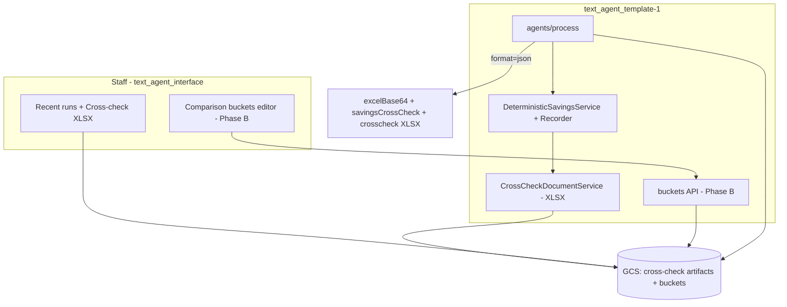

# Base 1 Comparison Buckets & Savings Cross-Check — Implementation Plan

Consolidated plan: staff-only savings cross-check (built first), then editable comparison buckets, single source of truth for deterministic savings, and reconciliation without reading backend logs.

**Repos:** `text_agent_template-1` (agent + engine), `text_agent_interface` (`/base-1` hub), `text_agent_backend` (legacy `base1.py` only — deprecation comment).

---

## 1. Current architecture

| Layer | Role |
|--------|------|
| **`text_agent_template-1`** | Base 1 Review Agent (Cloud Run). Gemini extraction → `DeterministicSavingsService` → Excel/PDF/email. Comparison figures are **hardcoded** in `lib/services/report/DeterministicSavingsService.ts`. |
| **`text_agent_interface`** `/base-1` | Hub: embeds agent, recent runs (backend sheet), lead pipeline. No config or cross-check UI yet. |
| **`text_agent_backend`** `tools/base1.py` | Legacy path with its own `MARKET_BENCHMARKS` — **not** used for live reviews. |

**Two different “bucket” concepts:**

- **Comparison buckets** — benchmark rates/thresholds the engine compares against (10/10/12 c/kWh, gas $/GJ tiers, metering $700/$900, etc.).
- **`base1AnalysisLabels.ts` buckets** — output grouping on the client Excel “Base 1 Analysis” sheet (utility + related charges). Unrelated to editable comparison rates.

**Existing pattern to copy:** GCS-backed `system-settings.json` via `GcsClient` + `/api/system-settings`.

**Existing API hook:** `POST /api/agents/process?format=json` already returns `excelBase64`, `htmlEmail`, `invoices`, `savingsSummary` — extend this response with the cross-check payload.

---

## 2. Goals

1. **Savings cross-check (priority)** — every client-sheet figure reproduced step-by-step from invoice inputs + comparison values, with formulas shown, returned by the API and stored per run. Staff can verify by hand without backend logs.
2. **Editable comparison buckets (follows)** — view/edit on `/base-1` without touching code.
3. **Single source of truth** — once buckets exist, `base1ComparisonBuckets` config drives `DeterministicSavingsService` and runtime prompt injection.
4. **IP protection** — cross-check and bucket detail are **staff-only**; never in client deliverables.

---

## 3. Comparison buckets (config) — Phase B

### 3.1 Schema — `base1-comparison-buckets.json` in GCS

```typescript
interface Base1ComparisonBuckets {
  version: number;
  updatedAt: string;
  updatedBy?: string;

  thresholds: {
    minAnnualSavingsAud: number;        // 200 — emission gate
    highSeverityMinSavingsAud: number;  // 2000
    highSeverityRateGapCPerKwh: number; // 5
  };

  gas: {
    minAnnualUsageGj: number;           // 1000 — annual GJ gate
    bundledEnergyMultiplier: number;    // 0.75
    // Tier bounds are ANNUAL GJ (annualised usage), not period GJ.
    tiers: Array<{ minGj: number; maxGj: number | null; benchmarkPerGj: number }>;
  };

  electricity: {
    retailTou: {
      nsw: { peakCPerKwh: number; shoulderCPerKwh: number; offPeakCPerKwh: number };
      other: {
        peakCPerKwh: number;
        offPeakCPerKwh: number;
        shoulderDefaultCPerKwh: number;
        shoulderWhenSameAsOffPeakCPerKwh: number;
        shoulderSameAsOffPeakTolerance: number; // 0.01
      };
    };
    metering: {
      noFindingMaxAnnual: number;       // 700
      midTierMaxAnnual: number;         // 1200
      midTierComparisonAnnual: number;  // 700
      highTierComparisonAnnual: number; // 900
      highSeverityMinAnnual: number;    // 1200
    };
    demand: {
      minRelativeOverstatement: number; // 0.02
    };
  };
}
```

Defaults = current hardcoded values in `DeterministicSavingsService.ts`.

**Gas tier matching:** `gasBenchmarkPerGj` selects the benchmark using **annualised** usage:

```
annual_usage_gj = (period_usage_gj / billing_days) × 365
```

Tier `minGj` / `maxGj` in the schema are **annual GJ/year** bounds, not period GJ on the invoice.

### 3.2 Validation (Zod, API boundary)

Server-side on every `PUT`. Client-side = UX only.

- **TOU:** off-peak &lt; peak; shoulder between off-peak and peak where applicable.
- **Gas tiers:** contiguous, monotonic — each `maxGj` = next `minGj`; last tier `maxGj: null`; bounds are **annual GJ**.
- **Ranges:** positive rates, sensible thresholds.

### 3.3 GCS persistence

- `getBase1ComparisonBuckets()` / `saveBase1ComparisonBuckets()`.
- **Enable GCS object versioning** on the bucket (full history).
- Saves use **`ifGenerationMatch`**; stale write → **409**.

### 3.4 API — `/api/base1-comparison-buckets`

| Method | Behaviour |
|--------|-----------|
| `GET` | Same protection as `PUT`: `X-Base1-Admin-Key` (or Cloud Run IAM). Interface proxy is sole caller, after NextAuth. Returns buckets + object **generation**. |
| `PUT` | Zod validate → generation precondition → save. Returns new generation. |

**Report generation** reads buckets **directly from GCS** in `agents/process` and export routes — not through this locked API.

### 3.5 Caching

Load buckets **once per request** (one snapshot per batch). **No cross-request in-memory cache** (Cloud Run horizontal scale / scale-to-zero).

### 3.6 Prompt sync (Phase B, required once buckets exist)

`PromptBuilderService` injects live bucket values at report time. Prompt **defers to the engine** — orient extraction and policy gates; do **not** restate dollar/cent thresholds as authoritative. Config + `DeterministicSavingsService` = single source of truth.

### 3.7 Interface editor (`/base-1`) — Phase B

Grouped fields + two plain-English helpers:

**Shoulder rule:**

> *“If shoulder is billed at the same rate as off-peak (within tolerance), use the off-peak comparison rate for shoulder; otherwise use the default shoulder comparison rate.”*

**Gas tier bounds:**

> *“Tier from/to values are annual GJ per year (period usage × 365 ÷ billing days), not GJ on this bill.”*

Proxy: `src/app/api/base1-comparison-buckets/route.ts` (session-gated). Editor stores generation; 409 → “Someone else edited this — reload”.

Env: `BASE1_AGENT_API_URL`, `BASE1_BUCKETS_WRITE_SECRET`.

### 3.8 Legacy `base1.py`

Behaviour unchanged. Add deprecation comment at top of `tools/base1.py` pointing to `base1ComparisonBuckets.ts` as the single source of truth for comparison figures.

---

## 4. Savings calculation cross-check — Phase A (build first)

### 4.1 What you want

Every figure on the client sheet, reproduced from invoice inputs and comparison rates, with the formula shown so each line can be checked by hand.

A real payload reconciliation tied out: peak $10,239.88, off-peak $2,200.88, metering $1,259.95, demand $1,695.93, gas $15,923.85 → **total $31,320.49**; conservative **80% = $25,056.39** — matches the client sheet range **$25,056–$31,320**.

**Critical requirement:** The cross-check must **emit values the engine already computed**, not formulas reverse-engineered from outputs. Refactor `DeterministicSavingsService` to record an audit row **at the moment each finding is accepted or rejected**, using the same code path that sets `low_hanging_fruit`.

**Layout reference:** The manually built `base1-savings-calculation-crosscheck.docx` is a layout reference only. Deliverable format is **XLSX** (see §4.5).

### 4.2 Per-finding row structure

Each **emitted** finding (and optionally each **rejected** candidate) includes:

| Field | Content |
|--------|---------|
| `findingId` | Stable id per run |
| `type` | e.g. `Retail peak rate (NSW)`, `Gas energy rate above Base 1 comparison` |
| `utility` | Electricity / Gas |
| `invoiceRef` | `invoice_number`, NMI/MRIN, `billing_days`, `site_address`, state inferred |
| **Inputs** | Raw extracted values used |
| **Comparison used** | Named bucket key + value (hardcoded initially; `configVersion` once buckets exist) |
| **Formula** | Literal engine formula from §4.3 |
| **Steps** | inputs → comparison rate → gap → period figure → annualisation `(× 365 / billing_days)` → **annual saving** |
| **Gates** | `$200` emission gate (pass/fail), severity rule, resulting `high` / `medium` |
| **Roll-up flags** | `includedInTotal`, `includedInCriticalIssues` (only `high` → critical) |
| **Client sheet line** | Benchmark group key if applicable |

### 4.3 Engine formulas — verification status

**Do not build the recorder until Step 0 is complete.** The formulas below are transcribed from `DeterministicSavingsService.ts`. Only the paths exercised by the sample payload have been reconciled to client-sheet numbers. The rest must be confirmed with targeted test invoices before the recorder encodes them.

#### Verification status

| Path | Status | Notes |
|------|--------|-------|
| OTHER-state 2-period TOU (peak / off-peak) | **Reconciled** | Sample was QLD — `inferRetailState` → `OTHER`, `hasThreePeriodTou` false → peak 9, off-peak 7 c/kWh |
| Unbundled gas, ≥30k annual GJ tier (13.9 $/GJ) | **Reconciled** | Sample hit top tier |
| Metering tier | **Reconciled** | annual_meter vs $700 / $900 |
| Demand repricing | **Reconciled** | period × annualisation; medium severity in sample |
| **NSW TOU** (10 / 10 / 12 c/kWh) | **Unverified** | Code read only — confirm with NSW 3-period invoice |
| **Shoulder comparison logic** (non-NSW, 3-period) | **Unverified** | `shoulderRetailComparisonCPerKwh`: 7 if shoulder ≈ off-peak within 0.01, else 9 |
| **Bundled gas** (`× 0.75` on ex-GST/GJ rate) | **Unverified** | `isGasBundledInvoice`: bundled unless `tariff_type` contains `unbundled` |
| **Gas tiers 17.1 / 15.0** (&lt;30k annual GJ) | **Unverified** | `gasBenchmarkPerGj`: &lt;10k → 17.1, &lt;30k → 15.0 — tier input is **annual GJ** |

#### Shared annualisation

```
annual_value = (period_value / billing_days) × 365
```

#### Retail TOU (per period — peak / shoulder / off-peak)

```
annual_usage_kwh = annualize(period_usage_kwh, billing_days)
gap_c_per_kwh    = current_rate - comparison_c_per_kwh   (skip if rate <= comparison)
annual_saving    = (gap_c_per_kwh / 100) × annual_usage_kwh
Emit if annual_saving >= $200
Severity high if: rate >= comparison + 5 c/kWh OR annual_saving >= $2000
Skip if flat/single-rate; skip shoulder if not 3-period TOU; skip if state unknown
```

**NSW:** peak 10, shoulder 10 (3-period only), off-peak 12 c/kWh.

**OTHER (VIC/QLD/SA/WA/TAS/ACT/NT):** peak 9, off-peak 7 c/kWh; shoulder (3-period only) per shoulder rule below.

**Shoulder comparison (non-NSW, 3-period only):**

```
if |shoulder_rate - off_peak_rate| < 0.01 → comparison = 7 c/kWh
else → comparison = 9 c/kWh
```

#### Metering

```
annual_meter = annualize(meter_charges, billing_days)
if annual_meter <= 700 → no finding
if annual_meter <= 1200 → comparison = $700/year
else → comparison = $900/year
annual_saving = annual_meter - comparison
Emit if >= $200
Severity high if: annual_meter > 1200 OR annual_saving >= $2000
```

#### Demand repricing

```
relative_overstatement = (billed_kw - recorded_kw) / billed_kw
period_saving = demand_charges × (1 - recorded_kw / billed_kw)
annual_saving = period_saving × (365 / billing_days)
Emit if relative_overstatement >= 0.02 AND annual_saving >= $200
Severity high if annual_saving >= $2000, else medium
```

#### Gas

```
annual_usage_gj = annualize(total_usage_gj, billing_days)   // ANNUAL GJ — tier selection uses this
Gate: annual_usage_gj >= 1000
Benchmark tier (annual GJ): [1k, 10k) → 17.1; [10k, 30k) → 15.0; ≥30k → 13.9 $/GJ
Bundled (no "unbundled" in tariff_type):
  energy_charge = (invoice_ex_gst / period_usage_gj) × 0.75
  annual_saving = annual_usage_gj × (energy_charge - benchmark)
Unbundled:
  annual_saving = annual_usage_gj × (retail_$/GJ - benchmark)
Emit if annual_saving >= $200
Severity high if annual_saving >= $2000
```

#### Portfolio roll-up (`calculateSavingsSummary` in `ReportTypes.ts`)

```
total_raw = sum of emitted findings’ annual_saving (eligible invoices only)
conservative = total_raw × 0.8
moderate     = total_raw × 1.0   (shown as “Expected” on sheet/email)
optimistic   = moderate          (deprecated alias — identical today)
criticalIssues = findings where severity === 'high' only
```

### 4.4 Reconciliation notes (show in cross-check header)

1. **Demand at medium severity** — counts toward **total** and client sheet bands; **excluded** from `criticalIssues` (high-only).
2. **`optimistic` = `moderate`** — optimistic band is a no-op; cross-check shows one “100% scenario” line and notes optimistic is deprecated.
3. **Eligible invoice filter** — `buildSavingsEligibleInvoiceIndexSet` may keep latest NMI only; cross-check flags which invoices contributed.
4. **Waste hidden on member report** — `hideWasteForMemberReport: true` on summary; cross-check shows all findings vs member-report subset if they differ.

### 4.5 Output formats & API contract

**Primary: JSON in API response**

Extend `POST /api/agents/process?format=json` (and export route) with:

```typescript
{
  // existing fields...
  savingsCrossCheck: {
    runId: string;
    generatedAt: string;
    configVersion: number | null;       // null while Phase A uses hardcoded defaults
    configGeneration?: string;
    formulasVerifiedAt: string;         // ISO date Step 0 completed
    findings: CrossCheckFindingRow[];
    skipped: CrossCheckSkippedRow[];
    rollUp: {
      totalRaw: number;
      conservative: number;
      moderate: number;
      optimistic: number;
      criticalIssuesCount: number;
      criticalIssuesSavings: number;
      mediumIncludedInTotal: number;
    };
    reconciliation: {
      matchesClientSheet: boolean;
      clientSheetConservative: number;
      clientSheetExpected: number;
      notes: string[];
    };
  };
  savingsCrossCheckXlsx: {
    base64: string;
    fileName: string;                   // e.g. {run-id}-savings-crosscheck.xlsx
  };
}
```

**Cross-check document: XLSX only**

Numeric reconciliation belongs in a spreadsheet. One format — **XLSX**. The docx is layout reference only.

Sheets:

1. **Summary** — roll-up, bands, config version (or “hardcoded defaults”), reconciliation notes.
2. **Findings** — one row per finding with step columns and formula.
3. **Skipped** — below $200, flat-rate skip, gas &lt; 1000 annual GJ, unverified-path test rows, etc.

**GCS artifact:** `{run-id}-savings-crosscheck.xlsx` (+ JSON) beside the run for **recent runs** on `/base-1`.

### 4.6 Access control

| Artifact | Client | Staff |
|----------|--------|-------|
| Client Excel/PDF | ✅ | ✅ |
| `savingsCrossCheck` JSON | ❌ | ✅ authenticated paths only |
| Cross-check XLSX | ❌ | ✅ recent runs + post-run download |
| Comparison buckets | ❌ | ✅ session + admin key |

**Never** embed cross-check in the client workbook. If ever embedded for internal convenience: `veryHidden` only (`worksheet.state = 'veryHidden'`) — obfuscation, not protection.

### 4.7 Implementation approach

1. **Step 0** — verify §4.3 unverified paths (see §8).
2. Add `SavingsCrossCheckRecorder` inside / alongside `DeterministicSavingsService` — returns `{ invoices, crossCheck }` from one pass, reading **current hardcoded constants** (no buckets config yet).
3. Refactor `maybeAdd*` methods to push structured rows before early returns on gates.
4. `CrossCheckDocumentService` — JSON → XLSX (ExcelJS; layout follows docx reference).
5. Wire into `agents/process` JSON branch and `export/generate-report`.
6. Persist to GCS; staff link on `/base-1` recent runs.

**Do not** build the document by parsing `low_hanging_fruit` strings post-hoc.

---

## 5. Security & ops

| Action | Protection |
|--------|------------|
| Read/write buckets | Session-gated interface proxy; template API requires `X-Base1-Admin-Key` for GET and PUT |
| Cross-check JSON / XLSX | Staff session only; omit from client/n8n payloads unless staff-authenticated |
| Config audit | `updatedBy` / `updatedAt` in JSON + GCS object versioning |
| Run audit | Cross-check records `configVersion` + generation per run (once buckets exist) |

Report generation reads buckets from GCS server-side once Phase B is live — API gating does not block runs.

**Dev vs prod:** separate GCS buckets / Cloud Run services.

---

## 6. Data flow



Phase A: engine reads hardcoded defaults. Phase B: engine reads buckets from GCS (once per request). Cross-check path does not go through the locked buckets API.

---

## 7. What to leave alone (for now)

- **`base1.py`** — deprecation comment only; no behaviour change.
- **`base1AnalysisLabels.ts`** — client sheet grouping only.
- **KB utilities (water/waste/oil)** — separate editable-config project later.

---

## 8. Implementation order

### Phase A — Cross-check first (priority)

| Step | Task |
|------|------|
| **0** | **Verify §4.3 against `DeterministicSavingsService.ts` before any recorder code.** Open the file; for each **unverified** path (NSW TOU, shoulder logic, bundled gas ×0.75, gas tiers 17.1/15.0), run a targeted test invoice through the engine and confirm outputs match the formulas. Document `formulasVerifiedAt` and any edge cases. **Do not pour a recorder on top of unconfirmed maths.** |
| **2** | Refactor `DeterministicSavingsService` to accept an optional cross-check recorder; emit structured rows inline while keeping **hardcoded** comparison constants. |
| **6** | `SavingsCrossCheckRecorder` + roll-up reconciliation block (`calculateSavingsSummary` alignment). |
| **7** | Extend `format=json` with `savingsCrossCheck` + `savingsCrossCheckXlsx` (base64). |
| **8** | GCS persist cross-check per run; staff “Cross-check” download on `/base-1` recent runs. |

### Phase B — Comparison buckets (follows)

| Step | Task |
|------|------|
| **1** | Schema + Zod + `DEFAULT_BASE1_COMPARISON_BUCKETS` (annual GJ tier semantics). |
| **3** | GCS buckets persistence (object versioning) + locked GET/PUT API + generation preconditions. |
| **4** | Wire process/export — load buckets once per request from GCS; recorder reads same snapshot. |
| **5** | Runtime prompt injection (`PromptBuilderService`). |
| **9** | Interface buckets editor (generation-aware; shoulder + annual GJ helpers). |
| **10** | `base1.py` deprecation comment. |
| **11** | Env vars for agent URL/password (cleanup `page.tsx` hardcoding). |

---

## 9. Effort estimate

| Workstream | Estimate |
|------------|----------|
| **Step 0** formula verification + test invoices | 0.5–1 day |
| Cross-check recorder + JSON + XLSX + GCS + recent runs | 2–3 days |
| Buckets config + API + editor + prompt injection | 3–4 days |
| Hardening + `base1.py` comment + env cleanup | 0.5 day |
| **Total** | **~6–8 days** |

Cross-check (Phase A) is deliverable in **~2.5–4 days** without waiting on the buckets editor.

---

## 10. Risks

| Risk | Mitigation |
|------|------------|
| **Unverified maths in recorder** | Step 0 gate; mark paths reconciled vs unverified in §4.3 |
| Drift (prompt vs engine) | Runtime injection once buckets exist; engine is source of truth |
| Invalid bucket edits | Zod at API boundary; annual GJ helper in editor |
| Concurrent bucket saves | `ifGenerationMatch` → 409 |
| Cross-check wrong maths | Record at compute time, not reverse-engineer from messages |
| IP leakage | Separate staff XLSX; never in client file |
| Old runs vs new buckets | Cross-check stores `configVersion` per run (Phase B) |
| Reconciliation confusion | Document demand-medium-in-total, optimistic=moderate, eligible-invoice filter |
| Gas tier misconfiguration | Schema + editor label tier bounds as **annual GJ/year** |

---

## 11. Summary

| Piece | What it does |
|-------|----------------|
| **Step 0** | Confirm NSW TOU, shoulder, bundled gas, 17.1/15.0 tiers against real invoices before recorder |
| **Cross-check JSON** | Returned on `format=json` — hand-verifiable maths per finding |
| **Cross-check XLSX** | Staff spreadsheet (only format); docx was layout reference |
| **GCS + recent runs** | Persisted per run for later audit |
| **Comparison buckets** | Phase B — editable GCS config; staff UI on `/base-1` |
| **Roll-up** | Total = sum of emitted findings; conservative = 80%; moderate = 100%; critical = high only |

**Build order:** cross-check first (Steps 0 → 2 → 6 → 7 → 8) on hardcoded defaults; buckets editor and config API after (Steps 1 → 3 → 4 → 5 → 9).
